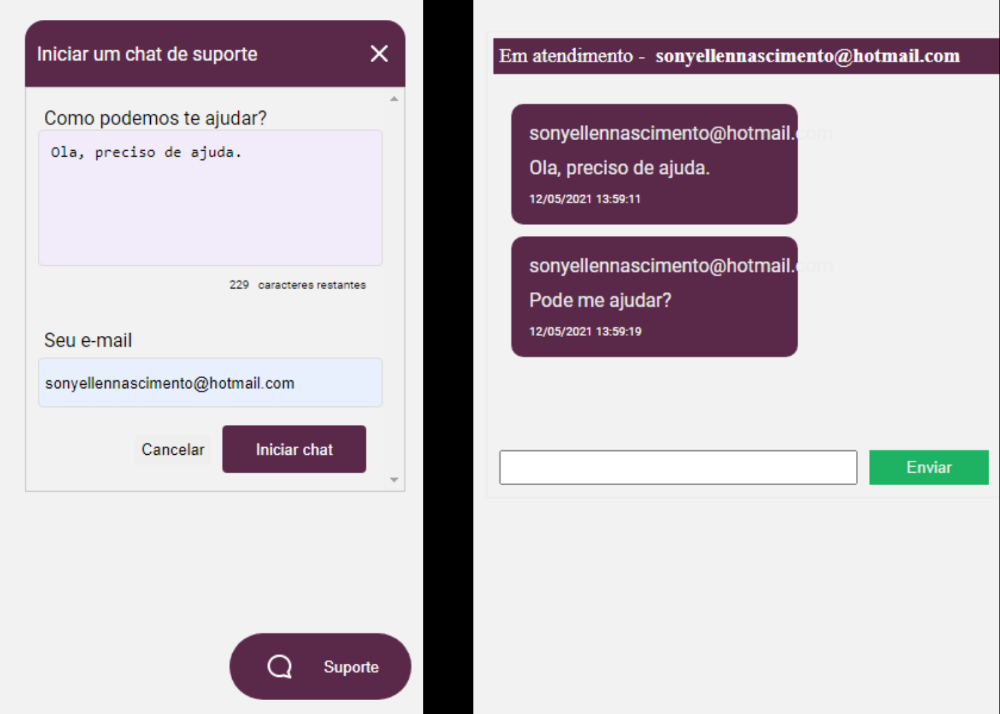

 

## Descrição do Projeto: :computer:

 Um chat para atendimento de clientes em tempo real. 

<h4 align="center"> 
	> Status do Projeto: Concluido :heavy_check_mark:
</h4>

<h1 align="center">
 
  
 

### Usando um task list, marcando tarefa como completada ou não  

- [X] Envio e recebimento de mensagem usuário
- [X] Envio e recebimento de mensagem admin

 

## Como rodar a apliação: :arrow_forward:

- Clone o repositório
- Caso ainda não tenha o arquivo `database.sqlite` dentro da pasta `src/database`, crie esse arquivo e rode `yarn typeorm migration:run` para criar as tabelas do banco de dados.
- Rode o `yarn dev` para iniciar a aplicação.
- Pronto, agora é possível acessar a apliação a partir da rota > http://localhost:3000/pages/client e http://localhost:3000/pages/admin

 

## Esse projeto foi desenvolvido com as seguintes tecnologias: :books:

- [Node.js](https://nodejs.org/en/)
- [Typescript](https://www.typescriptlang.org/)
- [Express](https://expressjs.com/pt-br/)
- [Socket.io](https://socket.io/)

 

## 📄 Licença

Esse projeto está sob a licença MIT. Veja o arquivo [LICENSE](LICENSE.md) para mais detalhes.

 

Feito com acompanhamento ♥ by Rocketseat
